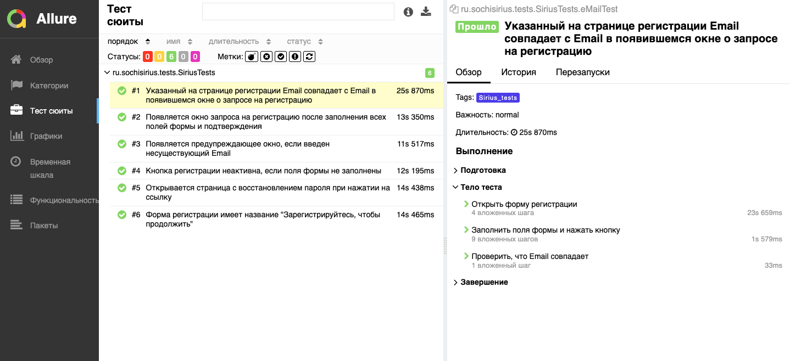
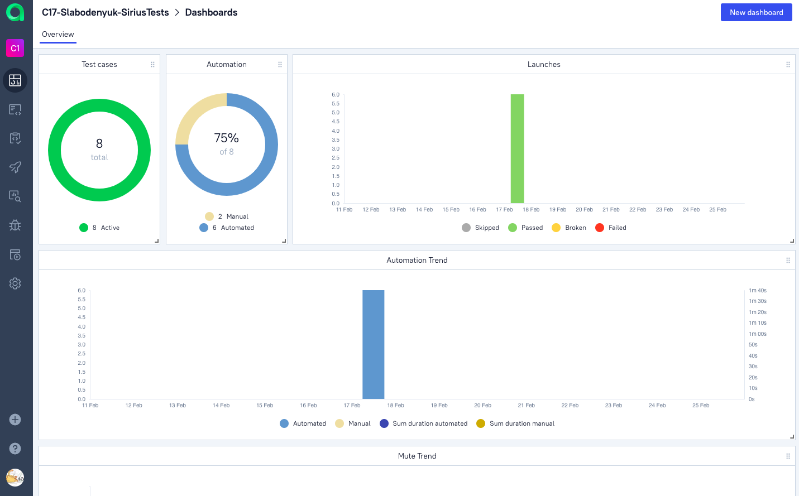
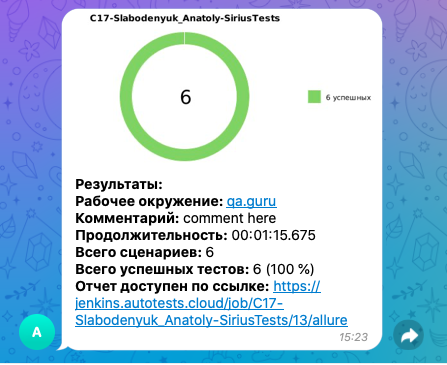

# :computer: Проект по автоматизации тестирования
### <a target="_blank" href="https://online.sochisirius.ru/auth">Страница регистрации Сириус Курсы</a>

<p align="center">

</p>

## :open_file_folder: Содержание:

- [Технологии и инструменты](#wrench-технологии-и-инструменты)
- [Список проверок](#white_check_mark-список-проверок)
- [Запуск тестов (сборка в Jenkins)](#electric_plug-запуск-тестов)
- [Allure-отчет](#img-srcimageslogoalluresvg-width25-height25--altallure-a-отчет-в-a-targetblank-hrefhttpsjenkinsautotestscloudjobc17-slabodenyuk-siriustests7allure-allure-report-a)
- [Интеграция с Allure TestOps](#img-srcimageslogoalluretosvg-width25-height25--altallure-a-интеграция-с-a-targetblank-hrefhttpsallureautotestscloudlaunch19106-allure-testops-a)
- [Уведомление в Telegram о результатах прогона тестов](#img-srcimageslogotelegramsvg-width25-height25--altallure-a-уведомление-в-telegram-о-результатах-прогона-тестов)
- [Видео пример прохождения тестов](#img-srcimageslogoselenoidsvg-width25-height25--altallure-a-пример-видео-прохождения-теста)

## :wrench: Технологии и инструменты

<p align="center">
<a href="https://www.jetbrains.com/idea/"></a>
<a href="https://www.java.com/"></a>
<a href="https://github.com/"></a>
<a href="https://junit.org/junit5/"></a>
<a href="https://gradle.org/"></a>
<a href="https://selenide.org/"></a>
<a href="https://aerokube.com/selenoid/"></a>
<a href="https://github.com/allure-framework/allure2"></a>
<a href="https://qameta.io/"></a>
<a href="https://www.atlassian.com/ru/software/jira"></a>
<a href="https://www.jenkins.io/"></a>
</p>

## :white_check_mark: Список проверок
### Автотесты

- [x] Проверка названия формы регистрации
- [x] Проверка отображения подтверждающего окна после прохождения регистрации
- [x] Проверка совпадения введенного Email с Email, указанным во всплывающем окне
- [x] Проверка отображения страницы восстановления пароля

### Ручные тесты

- [x] Проверка отображения кнопки для перехода на страницу регистрации
- [x] Проверка содержания кнопки меню
- [x] Проверка перехода на страницу регистрации после нажатия на кнопку с главной страницы

## :electric_plug: Запуск тестов

###  Локальный запуск :
Пример командной строки:
```bash
gradle clean ui_test
```
### Удаленный запуск с параметрами:
Пример настройки параметров Jenkins
```bash
clean 
ui_test
"-Dbrowser=${BROWSER}"
"-DbrowserVersion=${BROWSER_VERSION}"
"-DbrowserSize=${BROWSER_SIZE}"
"-Dremote=${REMOTE}"
```

###  Проект в Jenkins:
#### 1. Открыть <a target="_blank" href="https://jenkins.autotests.cloud/job/C17-Slabodenyuk-SiriusTests/">проект</a>


#### 2. Выбрать пункт **Собрать с параметрами**
#### 3. В случае необходимости изменить параметры, выбрав значения из выпадающих списков
#### 4. Нажать **Собрать**
#### 5. Результат запуска сборки можно посмотреть в отчёте Allure


## </a> Отчет в <a target="_blank" href="https://jenkins.autotests.cloud/job/C17-Slabodenyuk-SiriusTests/7/allure/">Allure report</a>

###  Главное окно

<p align="center">

</p>

###  Тесты

<p align="center">

</p>

###  Графики

<p align="center">

</p>


## </a> Интеграция с <a target="_blank" href="https://allure.autotests.cloud/launch/19106">Allure TestOps</a>
### Общий список всех кейсов: ручных и авто
<p align="center">

</p>

### Dashboard с общими результатами тестирования
<p align="center">

</p>

## </a> Уведомление в Telegram о результатах прогона тестов

<p align="center">

</p>

## </a> Пример видео прохождения теста
### Тест #2 Появляется окно запроса на регистрацию после заполнения всех полей формы и подтверждения
<p align="center">
 

</p>
